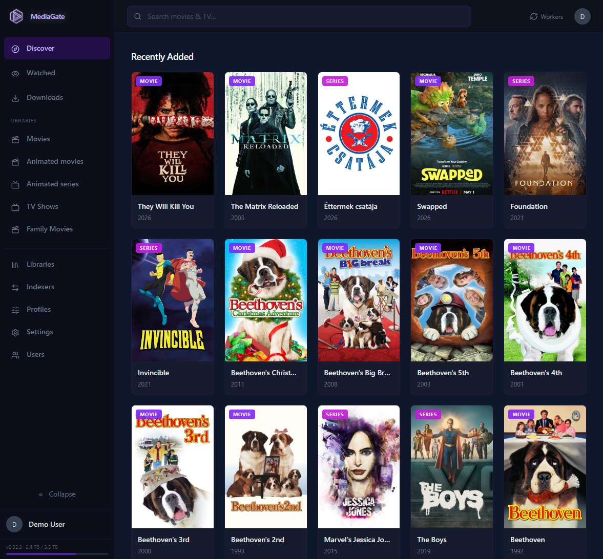
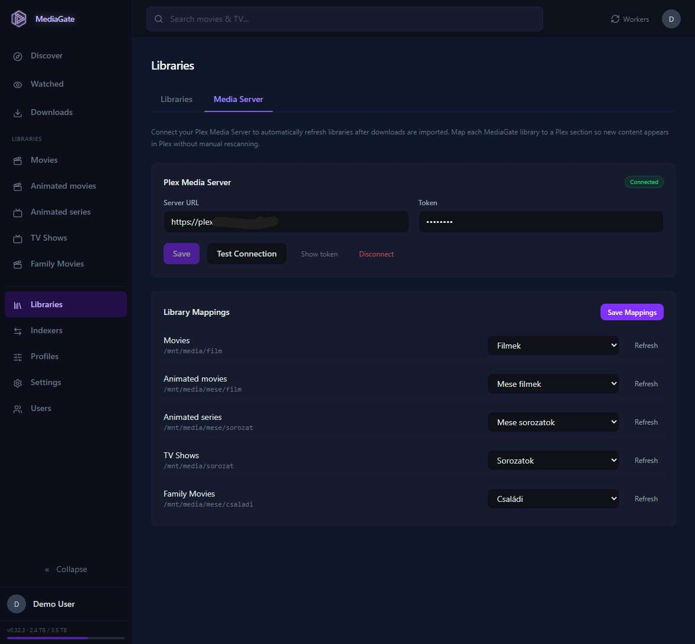

# MediaGate

[](https://ko-fi.com/R6R11XD6DX)

A self-hosted, single-binary media management app I built for my own homelab to consolidate what Sonarr, Radarr, Overseerr, Prowlarr, and Bazarr do into one place.

Go backend, Vue 3 frontend, one executable. No containers required, no runtime dependencies.

**~70 MB RAM | near-zero CPU** — runs comfortably on a Raspberry Pi or a minimal LXC container.



<details>
<summary><strong>More screenshots & demos</strong></summary>
<br>

<details>
<summary>Movie download — search, pick a release, send to qBittorrent</summary>


</details>

<details>
<summary>Profile & indexer search — test quality profiles against live results</summary>


</details>

<details>
<summary>TV show monitoring — episode-level auto-grab setup</summary>


</details>

<details>
<summary>Plex library mapping — auto-refresh after import</summary>


</details>

</details>

---

## Why

I was running Sonarr, Radarr, Overseerr, Prowlarr, and Bazarr side by side in my homelab — five services, each with its own database, update cycle, and failure modes. It worked, but felt like more moving parts than I needed. MediaGate is my attempt to fold all of that into a single process with a unified UI and one SQLite database.

## Features

### Library Management

- Create movie and series libraries mapped to filesystem directories
- Automatic directory scanning with video file detection (resolution, source type, season/episode parsing)
- Series folder grouping ("Show Name Season N" folders merged under one title)
- Media item status tracking: `new`, `requested`, `partial`, `available`, `missing`
- Re-sync individual items or entire libraries as async jobs with progress tracking
- Path traversal protection enforced at all filesystem access points

### Metadata Matching

- Automatic matching against TMDB and TVDB with confidence scoring
- Manual search and override when auto-match is wrong
- Full metadata: title, overview, genres, year, rating, runtime, release date, IMDB ID, trailer URL, cast/crew
- Complete episode data: season/episode structure, air dates, runtimes
- Poster downloading and local caching
- Library-wide batch matching with progress tracking
- Configurable primary metadata source (TMDB or TVDB)

### Discover & Search

- Global search across TMDB/TVDB by query and media type
- Discovery feeds: trending, popular movies, popular series
- Recently added feed from local libraries
- Full external media preview before adding to a library
- Duplicate detection: results indicate if media already exists locally

### Indexer Engine

- Cardigann-compatible YAML indexer definitions (700+ torrent sites via Prowlarr/Indexers)
- Background worker refreshes definitions from GitHub every 24 hours
- YAML sanitization for escape sequences that parsers reject
- Multi-indexer parallel search with category and result limit filtering
- Search modes: general, TV search (season/episode), movie search (IMDB ID)
- Per-indexer priority, seed ratio/time requirements
- FlareSolverr integration for Cloudflare-protected sites
- Connection testing per indexer

### Media Profiles (Quality Filtering)

- Define preferred resolutions, languages, source types (BluRay, WEB-DL, etc.)
- Language filtering with AND/OR mode: OR = any language matches (order = priority), AND = all languages required
- Priority-based ranking: resolution > language > source, with user-defined preference order
- Exclude tags to filter unwanted releases (global + per-profile)
- Season pack preference: `prefer_packs`, `prefer_episodes`, `packs_only`
- Assignable per-library or per-media-item (item overrides library)
- Profile test search: run live queries against indexers to preview filtering results
- Backend-driven profile matching: search results annotated with match status server-side (single source of truth)

### Download Management

- Full torrent lifecycle: `pending` → `downloading` → `downloaded` → `importing` → `seeding` → `completed`
- Background worker polls qBittorrent every 5 seconds (configurable)
- Automatic retry with exponential backoff (30s → 2m → 10m → 30m → 1h, up to 5 retries)
- qBittorrent health check: skips sending if unreachable to avoid burning retries
- Real-time progress, speed, and ETA tracking
- Inspect torrent file list per download
- Dual path support: local mount path vs qBittorrent NAS mount override
- qBittorrent category support

### Auto-Import

- Hardlinks completed downloads into organized library directories (preserves seeding)
- Season pack and single-episode detection via title parsing
- Post-import status recalculation
- Seeding obligation tracking: per-indexer seed ratio and seed time requirements
- Automatic torrent cleanup after seeding obligations are met
- Companion file handling (NFO, SRT) and empty directory cleanup

### Monitor (Automated Search & Grab)

- Background worker searches indexers every 15 minutes (configurable) for monitored media
- Episode-level monitoring hierarchy: episode monitor → season monitor → not monitored
- Monitors keyed by `(MediaItemID, SeasonNumber, EpisodeNumber)` — survives re-matching
- Toggle entire seasons (clears episode-level overrides)
- Auto-monitor new seasons when they appear
- Profile-based filtering of search results before grabbing

### Metadata Refresh

- Background worker checks every 6 hours (configurable) for new seasons/episodes
- Targets monitored series that are not "Ended" or "Canceled"
- Creates episode records and season monitors when new content is discovered
- Recalculates media item status after updates
- Resolves orphan downloads: backfills episode IDs on downloads created before the episode existed in the database

### Subtitles

- Search and download subtitles from OpenSubtitles.com
- Multi-language support with priority ordering
- Automatic subtitle search after media import (configurable)
- Metadata: language, hearing impaired flag, foreign parts only, trust score, hash match
- Per-item subtitle management (list, download, delete)

### Watched Tracking

- Mark/unmark media as watched with seen badges across the UI
- Mode: global (shared) or per-user
- Stores external IDs for cross-reference with metadata providers

### Notifications

- Discord webhook notifications on import events
- Rich embeds with media title, year, type, and poster image
- Connection testing from the UI

### Plex Integration

- Automatic library refresh after download import
- Auto-matches MediaGate libraries to Plex sections by type and path
- Manual section mapping override per library
- Retry with exponential backoff on transient Plex failures
- Manual per-library refresh trigger from the UI

### Self-Update

- Background worker checks GitHub Releases every 6 hours (configurable)
- In-process binary replacement (Linux)
- UI shows current version, update availability, release notes, published date
- Manual check and apply from settings

### Real-Time UI (Event Bus + SSE)

- Internal typed event bus with Server-Sent Events push to frontends
- Covers full lifecycle: downloads, imports, library sync, matching, monitoring, subtitles, updates
- SSE authentication via single-use 30-second tickets

### Multi-User Auth & Security

- Multi-user support with registration, login, profile management
- **Admin/user role system** — first user is admin; admin-only access to settings, libraries, indexers, profiles, workers, updates, Plex, and user management
- JWT access tokens (15min) + refresh tokens (24h / 30d with "remember me")
- HTTP-only cookies, optional secure flag for TLS reverse proxies
- Password hashing (bcrypt), refresh token hashing (SHA-256)
- AES-256-GCM at-rest encryption for sensitive settings
- Path traversal protection at three enforcement points
- XSS sanitization on user-facing HTML content (indexer descriptions)
- 6-step browser-based onboarding wizard on first launch

### Administration

- Admin role required for all management operations (enforced via centralized middleware)
- Database export endpoint for backup and debugging (full SQLite dump via API, admin-only)
- Self-delete prevention (users cannot delete themselves)

### Observability

- Optional OpenTelemetry distributed tracing and log export (OTLP HTTP)
- slog records tee'd to both stdout and OTLP backend with independent log level control
- Hot-swappable TracerProvider and LoggerProvider (noop when disabled)
- Automatic HTTP span propagation via shared instrumented client
- Configurable from the UI: enable/disable, endpoint, service name, log level

## Integrations

| Service | Purpose |
|---------|---------|
| **TMDB** | Movie/series metadata, posters, trending/popular feeds |
| **TVDB** | Series metadata, episode data |
| **qBittorrent** | Torrent downloading, progress tracking, cleanup |
| **Prowlarr/Indexers** | 700+ torrent indexer definitions (Cardigann YAML) |
| **FlareSolverr** | Cloudflare challenge bypass for protected indexer sites |
| **Plex** | Automatic library refresh after import (section-level scan trigger) |
| **Discord** | Webhook notifications for import events |
| **OpenSubtitles.com** | Subtitle search and download |
| **GitHub Releases** | Self-update checking and binary replacement |

## Background Workers

| Worker | Default Interval | Purpose |
|--------|-----------------|---------|
| Monitor | 15 min | Auto-search and grab for monitored media |
| Download | 5 sec | Send pending torrents, poll active downloads |
| Importer | 10 sec | Hardlink completed downloads, cleanup after seeding |
| Metadata Refresh | 6 hours | Check for new seasons/episodes |
| Update Check | 6 hours | Check GitHub for new releases |
| Indexer Definitions | 24 hours | Refresh Prowlarr definitions from GitHub |

The UI includes a dedicated **Workers panel** with real-time SSE-driven status for each worker (last run, next run, current state) and manual trigger buttons to run any worker on demand.

## Tech stack

| Layer | Tech |
|-------|------|
| Backend | Go 1.22+, stdlib `net/http`, GORM, `log/slog`, koanf |
| Frontend | Vue 3 + TypeScript (Composition API), Tailwind CSS v4, Vue Router, Lucide icons |
| Database | SQLite via pure-Go driver (`glebarez/sqlite`) — no CGO needed |
| API contract | OpenAPI spec &rarr; `oapi-codegen` (Go) + `openapi-typescript` (TS) |
| Build | Makefile + Docker multi-stage for cross-compilation |

## Quick start

### Development

```bash
make tools      # install air + oapi-codegen
make dev        # Air (Go hot-reload) + Vite (frontend HMR) in parallel
```

### Production build

```bash
make build      # generate code, build frontend, compile single binary
./media-gate    # serves UI + API on :8080
```

### Cross-platform release builds

```bash
make build-linux-amd64
make build-darwin-arm64
make build-windows-amd64
make build-all          # all three
```

Uses `Dockerfile.build` — Docker required, CGO is not.

## Configuration

Copy `backend/.env.example` to `backend/.env`, or use `MEDIAGATE_`-prefixed environment variables.

| Key | Default | Description |
|-----|---------|-------------|
| `SECRET_KEY` | — | **Required.** Master key for encryption + JWT signing |
| `API_PORT` | `8080` | HTTP server port |
| `DB_PATH` | `media-gate.db` | SQLite database path |
| `LIBRARY_BASEPATH` | `/mnt` | Root path for library directories |
| `LOG_LEVEL` | `info` | `debug` / `info` / `warn` / `error` |
| `TMDB_APIKEY` | — | Fallback TMDB key (can also set in UI) |
| `TVDB_APIKEY` | — | Fallback TVDB key (can also set in UI) |
| `COOKIE_SECURE` | `false` | Set `true` behind a TLS-terminating reverse proxy |

Most settings are configurable through the web UI after initial setup.

## Deployment

**Simplest path:** copy the binary, create a systemd service, point a reverse proxy at it.

**Proxmox LXC:** `deploy/proxmox-lxc.sh` is an interactive script that creates a Debian 12 LXC container, downloads the binary from GitHub Releases, sets up a systemd unit, and optionally configures a CIFS NAS mount. Includes an in-place update script.

**Releases:** GitHub Actions builds cross-platform binaries on `v*` tag push.

## Project structure

```
media-gate/
├── backend/             # Go backend
│   ├── cmd/server/      #   entrypoint
│   ├── internal/        #   domain packages (api, auth, library, sync,
│   │                    #   matching, download, importer, indexer, ...)
│   └── frontend/        #   embed.go (compiled SPA embedded here)
├── frontend/            # Vue 3 + TypeScript SPA
│   └── src/
│       ├── api/         #   generated API client
│       ├── composables/ #   shared reactive state
│       ├── components/  #   UI components (layout, media)
│       └── views/       #   route-level pages
├── api/                 # OpenAPI spec (single source of truth)
├── docs/                # architecture decisions, roadmap
├── deploy/              # Proxmox LXC deployment script
├── Dockerfile.build     # multi-stage cross-platform builder
└── Makefile             # build pipeline
```

## Architecture highlights

- **OpenAPI-first** — change the spec in `api/openapi.yaml`, run `make generate`, never hand-edit generated code
- **Store interface pattern** — all data access through a Go interface with GORM implementations; `WithTx` for transactional writes
- **Single binary** — Vue SPA builds into `frontend/dist/`, embedded into Go via `go:embed`
- **Pure-Go SQLite** — no CGO, trivial cross-compilation
- **Event-driven** — internal event bus with typed events, SSE broker pushes to frontends
- **Thin HTTP handlers** — handlers are pure adapters; all business logic lives in service packages

Design decisions are documented as ADRs in `docs/DECISIONS.md`. Full roadmap in `docs/ROADMAP.md`.

## Status

This is an actively developed personal project. The core loop — discover, match, search indexers, download, import, monitor — is functional. See `docs/ROADMAP.md` for completed phases and what's planned.

## Disclaimer

MediaGate is a media library management tool. Users are solely responsible for ensuring their use of this software complies with all applicable laws in their jurisdiction. The authors do not endorse or encourage copyright infringement or any other illegal activity.

## License

This project is licensed under the [GNU General Public License v2.0](LICENSE).

## Support

If you find this project useful, consider [buying me a coffee](https://ko-fi.com/sumia01).
